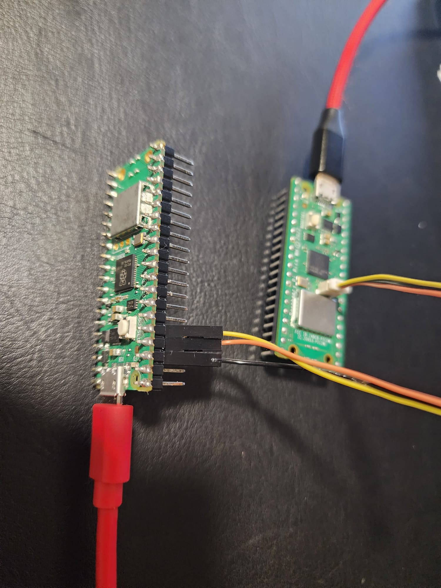
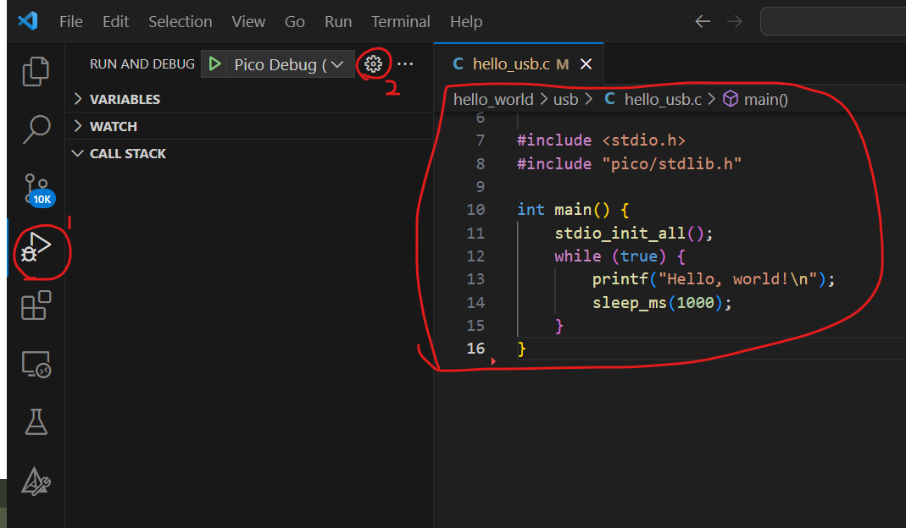
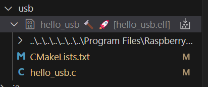
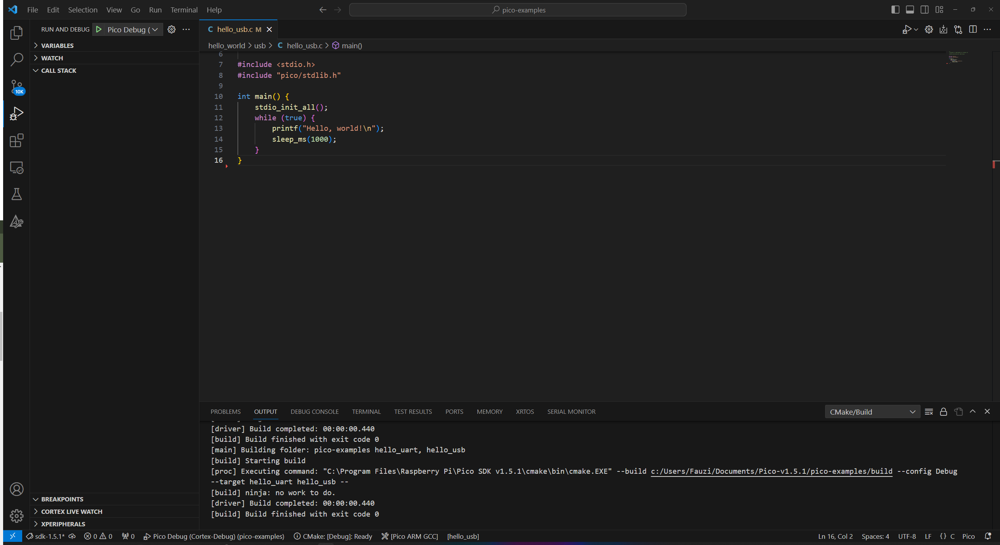

# LAB 6: OPTIMISATION & DEBUGGING

**OBJECTIVES**
-	Implement a few optimisation methods
-	Configure and use a debugger for the Raspberry Pi Pico


**EQUIPMENT** 
1.	A laptop that has the Pico C/C++ SDK installed
2.	Raspberry Pico W
3.	Micro-USB Cable

> [NOTE]
> Only students wearing fully covered shoes are allowed in the SR6A lab due to safety.

## **INTRODUCTION** 

This lab focuses on two essential aspects of embedded systems programming with the Raspberry Pi Pico: optimization and debugging. Optimization ensures efficient code execution, while debugging tools and techniques help identify and fix errors in your code. These skills are vital for developing reliable and high-performance embedded applications. Optimization is particularly crucial for embedded systems like the Raspberry Pi Pico due to their limited resources, real-time requirements, and cost considerations. It helps improve performance, efficiency, and cost-effectiveness. Debugging is essential for ensuring that applications on embedded systems work correctly. It helps you find and resolve errors in your code, which is especially important for embedded systems where errors can lead to system crashes or failures. Some examples of optimization include choosing the right data types, using efficient algorithms, optimizing memory usage, and reducing power consumption.

## **OPTIMISATION TECHNIQUES**

In the context of embedded systems, optimization techniques are fundamental practices that enhance the efficiency and performance of software running on resource-constrained devices like microcontrollers. Code optimization involves refining algorithms, reducing unnecessary operations, and optimizing code structure to ensure faster execution and minimal resource consumption. Memory optimization is crucial for conserving limited memory resources by employing efficient data structures and variable management. Compiler optimization, specifically tailored for embedded systems, fine-tunes code translation to machine code, resulting in improved execution speed and reduced memory usage. These techniques are essential for developing embedded applications that operate efficiently, meet real-time constraints, and maximise the limited hardware resources available in embedded systems. Verifying and observing optimization techniques in embedded systems programming, particularly on platforms like the Raspberry Pi Pico, combines techniques and tools. Here's how you can verify and observe the optimization techniques discussed. 

We discussed the various techniques that can be deployed to improve execution performance. In this lab session, we will employ timing functions to measure and record the program's execution time before and after optimization. This data will allow you to quantitatively assess the effectiveness of the applied optimizations and gain insights into the performance improvements achieved.

**Execution Time Measurement**

The following is a simple code example in C for measuring and comparing execution times before and after optimization using the `pico_time.h` library on the Raspberry Pi Pico. In this example, we have a simple `timeConsumingTask()` function simulating a computationally intensive task that we would like to measure the execution time before and after optimization and then compare the results to determine the effectiveness of the optimizations. You can apply your specific optimizations within the code and observe their impact on execution time.

> [NOTE]
> Some newer compilers can perform optimisation automatically (without our consent!). Thus, sometimes you don't see a difference before and after because of this.

```c
#include <stdio.h>
#include "pico/stdlib.h"
#include "pico/time.h"

// Function to perform a time-consuming task
void timeConsumingTask() {
    for (int i = 0; i < 1000000; i++) {
        // Simulate some computation
        int result = i * 2;
    }
}

int main() {
    // Initialize the Raspberry Pi Pico SDK
    stdio_init_all();

    // Measure execution time before optimization
    absolute_time_t start_time = get_absolute_time();
    timeConsumingTask();
    absolute_time_t end_time = get_absolute_time();

    uint32_t execution_time_before = absolute_time_diff_us(start_time, end_time);

    // Output execution time before optimization
    printf("Execution Time Before Optimization: %d microseconds\n", execution_time_before);

    // Apply optimizations (you can add your optimizations here)

    // Measure execution time after optimization
    start_time = get_absolute_time();
    timeConsumingTask();
    end_time = get_absolute_time();

    uint32_t execution_time_after = absolute_time_diff_us(start_time, end_time);

    // Output execution time after optimization
    printf("Execution Time After Optimization: %d microseconds\n", execution_time_after);

    // Compare execution times
    if (execution_time_after < execution_time_before) {
        printf("Optimizations were effective in reducing execution time.\n");
    } else {
        printf("Optimizations did not significantly improve execution time.\n");
    }

    return 0;
}
```
**Reducing Clock Speed for Lower Power**

Power optimization through clock speed reduction is common in embedded systems, including those based on the Raspberry Pi Pico or similar microcontrollers. The idea is to lower the clock frequency of the microcontroller to reduce power consumption while still meeting the application's performance requirements. 

The sample code [hello_48MHz](https://github.com/raspberrypi/pico-examples/blob/master/clocks/hello_48MHz/hello_48MHz.c) demonstrates how the main clock speed of the Raspberry Pi Pico can be reduced from 125Mhz to 48Mhz. However, reducing the clock speed will slow down the microcontroller and thus take longer for code to run. All other clocks that are derived from the main clock will be immediately affected by this, e.g. PWM, Timer, etc.

> [NOTE]
> Remember to include `pico_enable_stdio_usb(hello_48MHz 1)`


## Debugging Tools and Techniques

**LED Debugging**

Incorporate an LED into your Raspberry Pi Pico project to offer visual cues throughout program execution. By employing various LED blinking patterns, you can effectively communicate specific program states or highlight potential errors, enhancing the user interface and debugging process. Harness the LED's behavior as a debugging aid, allowing you to observe its responses to code execution and swiftly identify any issues that may arise. This integrated approach of using an LED not only enhances user interaction but also streamlines the debugging and troubleshooting aspects of your embedded system development.

To incorporate the necessary libraries.
```
#include "pico/cyw43_arch.h"
#include "hardware/gpio.h"
```

To initialise the LED that is connected to the WiFi SoC
```
    if (cyw43_arch_init()) {
        printf("Wi-Fi init failed");
        return -1;
    }
```

You can define the following function to control the blinking LED to observe the application's progress.
```
void blink_led(uint gpio_pin, uint32_t period_ms, int num_blinks) {
    for (int i = 0; i < num_blinks; i++) {
        cyw43_arch_gpio_put(CYW43_WL_GPIO_LED_PIN, 1);  // Turn the LED on
        sleep_ms(period_ms);
        cyw43_arch_gpio_put(CYW43_WL_GPIO_LED_PIN, 0);  // Turn the LED off
        sleep_ms(period_ms);
    }
}
```

**Serial Debugging with UART**

This method has been used since lab 1. It establishes UART communication between your Raspberry Pi Pico and computer, enabling the exchange of debugging information such as variable values, status updates, and execution progress. This communication is achieved through methods like `printf`. Utilize a serial terminal or debugging tool on your computer to receive and assess the UART output, facilitating effective debugging of your Pico-based projects. Remember to include the following in the project's CMakeLists.txt file (BEFORE `pico_add_extra_outputs(picow_xxx)`):

``` c
pico_enable_stdio_usb(picow_xxxx 1)
```

**Debugging with PicoProbe or Debug Probe**

The following image demonstrates how to connect the debugger, PicoProbe (left) connected to the target Pico (right).


The following is the launch.json file (for those using Windows).
```
{
  "version": "0.2.0",
  "configurations": [
    {
      "name": "Pico Debug (Cortex-Debug)",
      "cwd": "${workspaceFolder}",
      "executable": "${command:cmake.launchTargetPath}",
      "request": "launch",
      "type": "cortex-debug",
      "servertype": "openocd",
      "gdbPath": "arm-none-eabi-gdb",
      "device": "RP2040",
      "configFiles": [
        "interface/cmsis-dap.cfg",
        "target/rp2040.cfg"
      ],
      "svdFile": "${env:PICO_SDK_PATH}/src/rp2040/hardware_regs/rp2040.svd",
      "runToEntryPoint": "main",
      "openOCDLaunchCommands": [
        "adapter speed 5000"
      ]
    }
]
}
```

The screenshot below illustrates how to start the debugging process.







## **EXERCISE**

Here's a pseudo-code representation of the given C code for a PID controller. Find the logical and syntax errors in the following [code]().
```c
// Initialize PID controller parameters
Kp = 1.0
Ki = 0.1
Kd = 0.01

// Initialize variables
setpoint = 100.0
current_value = 0.0
integral = 0.0
prev_error = 0.0

// Initialize simulation parameters
time_step = 0.1
num_iterations = 100

// Main control loop
for i = 0 to num_iterations - 1:
    // Compute error
    error = setpoint - current_value

    // Update integral term
    integral += error

    // Compute derivative term
    derivative = error - prev_error

    // Compute control signal
    control_signal = Kp * error + Ki * integral + Kd * derivative

    // Update previous error
    prev_error = error

    // Simulate motor dynamics (for demonstration purposes)
    motor_response = control_signal * 0.1

    // Update current position
    current_value += motor_response

    // Display results
    Print "Iteration ", i, ": Control Signal = ", control_signal, ", Current Position = ", current_value

    // Sleep for the time step (for demonstration purposes)
    Sleep for time_step seconds

// End of main control loop
```

This pseudo code provides a high-level description of the PID control algorithm and the simulation loop. It outlines the key steps and calculations performed in the code without getting into specific programming language syntax.
```

## Additional Resources
[Raspberry Pi Pico SDK Documentation](https://www.raspberrypi.com/documentation/pico-sdk/index_doxygen.html)
